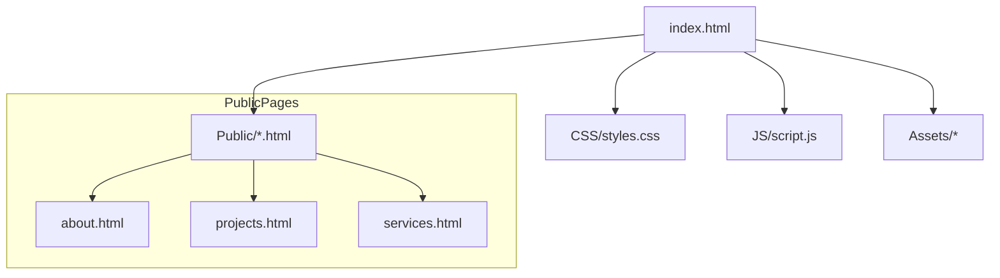

## 🚀 Emobilis Week One — Portfolio Assignment

A clean, responsive personal portfolio landing page for Mark Lewis built as part of the Emobilis Week One assignment.

This repository contains a static HTML/CSS/JavaScript portfolio that showcases skills, services, featured projects, and a contact form. The goal for Week One was to create an attractive, accessible landing page and basic project pages.

---

## 📁 Project structure

```text
portfolioAssign/
├─ index.html                # Landing page (home)
├─ README.md                 # (this file)
├─ Assets/                   # images (profile, project screenshots)
├─ CSS/
│  └─ styles.css             # Main stylesheet
├─ JS/
│  └─ script.js              # Page interactions (nav shrink, form demo, reveal)
└─ Public/
   ├─ about.html            # About page
   ├─ projects.html         # Projects listing (source for featured cards)
   └─ services.html         # Services details
```

Mermaid diagram (visual):



---

## ✨ Features included

- Hero section with profile image, short pitch and CTAs (View Projects, Contact).
- Services / Offerings block with three core offerings.
- Featured Projects block (cards copied from `Public/projects.html`).
- Testimonials section.
- Contact form (frontend demo — logs to console and shows visual confirmation on submit).
- Responsive styles using Bootstrap + custom `CSS/styles.css`.
- Small JS enhancements in `JS/script.js`:
  - Dynamic current year in the footer
  - Navbar shrink on scroll
  - Smooth scrolling for internal anchors
  - Reveal-on-scroll animations (IntersectionObserver)

---

## 🧭 Mini contract (inputs / outputs / success criteria)

- Inputs: static files (`.html`, `.css`, `.js`) served from the project root.
- Outputs: a rendered portfolio site (browser) showing hero, services, projects, testimonials, and contact form.
- Success criteria:
  - Landing page loads without console errors.
  - Nav shrink and smooth-scroll behaviors work.
  - Featured projects match the entries in `Public/projects.html`.

Error modes:

- Missing assets (project images) will show placeholders; verify `Assets/` contains required images.
- Links with `target="_blank"` may need `rel="noopener noreferrer"` added for security — see Known Issues.

---

## ⚙️ How to preview locally

Choice A — Open the file directly (quickest):

PowerShell:
```powershell
Start-Process 'c:\Users\Test\Desktop\portfolioAssign\index.html'
```

Choice B — Serve via a simple HTTP server (recommended):

If you have Python installed:
```powershell
cd 'c:\Users\Test\Desktop\portfolioAssign'
python -m http.server 8000
# then open http://localhost:8000 in your browser
```

Why serve via HTTP? Some browser features and relative paths (and future APIs) behave more consistently when files are served over HTTP rather than via the `file://` protocol.

---

## 🛠️ Development notes & edits made

- Fixed local asset paths in `index.html` so it now references `CSS/styles.css`, `JS/script.js`, and `Assets/marklewis.jpg` from the project root.
- Replaced placeholder featured projects on `index.html` with the actual project cards taken from `Public/projects.html` (AkiliSpa, Kazi-Haven, Uni-Market Finds).
- Removed an inline style from the contact `textarea` and moved sizing to `CSS/styles.css`.
- Added CSS classes and small JavaScript features to improve UX (reveal animations, smooth-scroll, nav collapse on mobile click).

---

## ⚠️ Known issues & recommendations

1. Security for external links

   Several links use `target="_blank"` (intentional to open external sites). For security and performance add `rel="noopener noreferrer"` to these anchors. Example to fix in `index.html` and `Public/projects.html`:

   ```html
   <a href="https://github.com/username/repo" target="_blank" rel="noopener noreferrer">View Repo</a>
   ```

2. Inline styles in `Public/*.html`

   Some `header` elements in `Public/about.html` and `Public/services.html` currently use inline styles. Consider moving those to `CSS/styles.css` to keep styles centralized.

3. Missing asset placeholders

   The featured projects on the landing page reference placeholder images (via.placeholder.com). Replace these with real screenshots by adding `Assets/project1.jpg`, `Assets/project2.jpg`, etc., or update the `src` attributes to point to real images.

---

## ✅ Suggested next steps (pick any)

1. Add `rel="noopener noreferrer"` to all `target="_blank"` anchors across the repo (I can do this automatically).
2. Replace placeholder project images with real screenshots in `Assets/`.
3. Wire the contact form to a backend (Formspree, Netlify Forms, or a server endpoint) — tell me which provider and I can add configuration.
4. Add a small unit/visual test or CI check (HTML validator/linter) to catch inline styles and missing rel attributes automatically.

---

## 📬 Contact / Author

Mark Lewis — portfolio built for Emobilis Week One.
